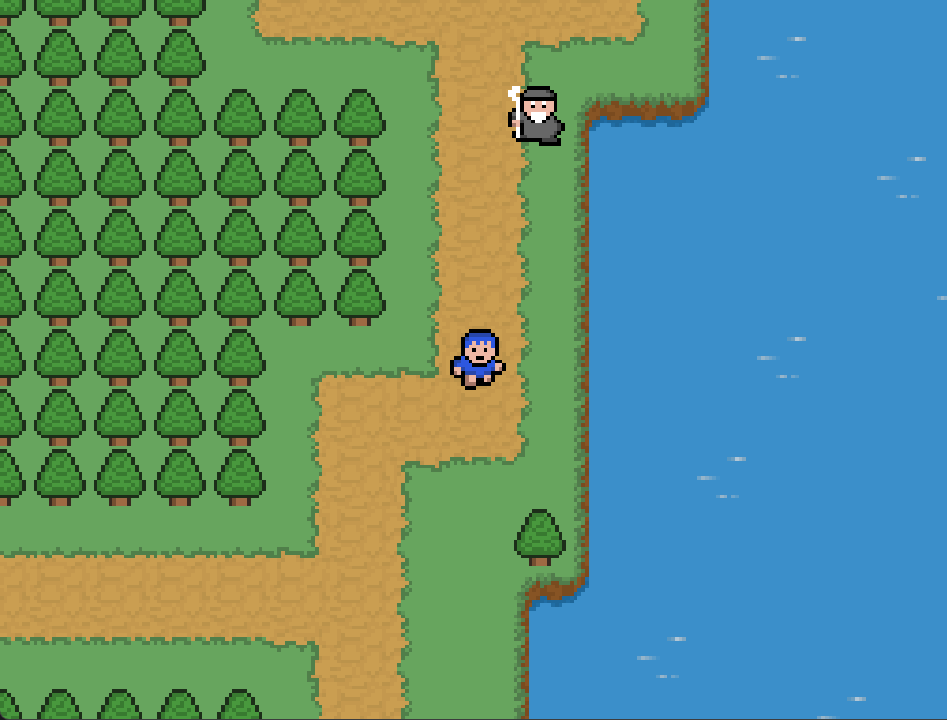

# 2D Adventure Game

A Java-based 2D adventure game developed as a personal learning project to practice Object-Oriented Programming, game development, and real-time application logic.

## Overview

The project is a tile-based 2D adventure game featuring a controllable player, animated sprites, NPC behavior, collision detection, background music, sound effects, and a pause system.

### Gameplay
The player explores the game world, interacts with NPCs, and navigates through different areas while avoiding obstacles.

The game uses a custom game loop to continuously update the game state and render the game world.

## Features

- Real-time game loop with continuous updates and rendering
- Player movement and sprite animation
- Tile-based game world with maps loaded from external files
- Collision detection with the environment and game objects
- Object-oriented structure for game objects such as keys, doors, and chests
- NPC with randomized movement behavior
- Pause and resume game state
- Background music and sound effects

## Technologies

- **Java**
- **Java Swing & AWT** – graphics, window management, and keyboard input
- **Object-Oriented Programming (OOP)**
- **Git & GitHub**
- **Eclipse**

## Technical Highlights

### Game Loop
Implemented a real-time game loop responsible for continuously updating the game state and rendering the game world.

### Collision Detection
Implemented collision detection using `Rectangle` boundaries to prevent entities from moving through blocked areas and objects.

### Object-Oriented Design
Used inheritance and reusable classes to represent game entities. For example, `Player` and `NPC_OldMan` extend the base `Entity` class.

### Tile-Based World
Built a tile-based game world where map layouts are loaded from external text files, separating the game data from the Java code.

### Audio
Implemented background music and sound effects using Java's audio capabilities.

## Controls

| Key | Action |
|-----|--------|
| Arrow Keys | Move the player |
| P | Pause / Resume |

## How to Run

1. Clone the repository.
2. Import the project into Eclipse as an existing Java project.
3. Make sure the `res` directory is available to the project.
4. Run `Main.java`.

## Learning Context

This project was developed as a hands-on learning project while studying Java 2D game development. It was built while following concepts from the RyiSnow Java 2D Game Development tutorial series, with the code written and implemented as part of the learning process.

The project provided practical experience with Java, Object-Oriented Programming, game loops, collision detection, inheritance, resource management, and basic game architecture.
